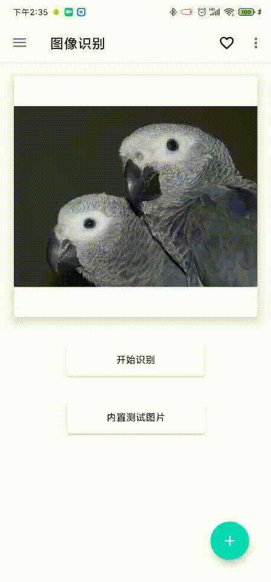

# pytorch_android_kotlin

An Android project containing image recognition and object detection models.

Users can input images into the deep learning model by taking photos, opening photo albums, and real-time previews on the Android side. After the calculation on the Android side is completed, the model will output the prediction result and show it to the user.

## Released
Demo released

## Getting Started

### Software

Android Studio

Pytorch 1.9

### Dependency
Add the dependency --- build.gradle(Module)
```
// CameraX
implementation "androidx.camera:camera-camera2:1.0.0"
implementation "androidx.camera:camera-lifecycle:1.0.0"
implementation "androidx.camera:camera-view:1.0.0-alpha24"

// pytorch_android
implementation 'org.pytorch:pytorch_android_lite:1.9.0'
implementation 'org.pytorch:pytorch_android_torchvision:1.9.0'

// https://github.com/leinardi/FloatingActionButtonSpeedDial
implementation "com.leinardi.android:speed-dial:3.2.0"

// https://github.com/guolindev/PermissionX
implementation 'com.permissionx.guolindev:permissionx:1.4.0'
```

Enable ViewBinding --- build.gradle(Module)
```
android {
    ...
    buildFeatures {
        viewBinding true
    }
}
```

Using androidx libraries --- gradle.properties
```
android.useAndroidX=true
android.enableJetifier=true
```

Build and enjoy it


## Demo
### Image recognition
#### Test image


#### Take photo


#### From album


#### Real time


### Object detection
#### Test image


#### Take photo


#### From album


#### Real time


## License

This project is licensed under the MIT License - see the [LICENSE.md](LICENSE.md) file for details

## Acknowledgments

* Hat tip to anyone whose code was used
* Inspiration
* etc
